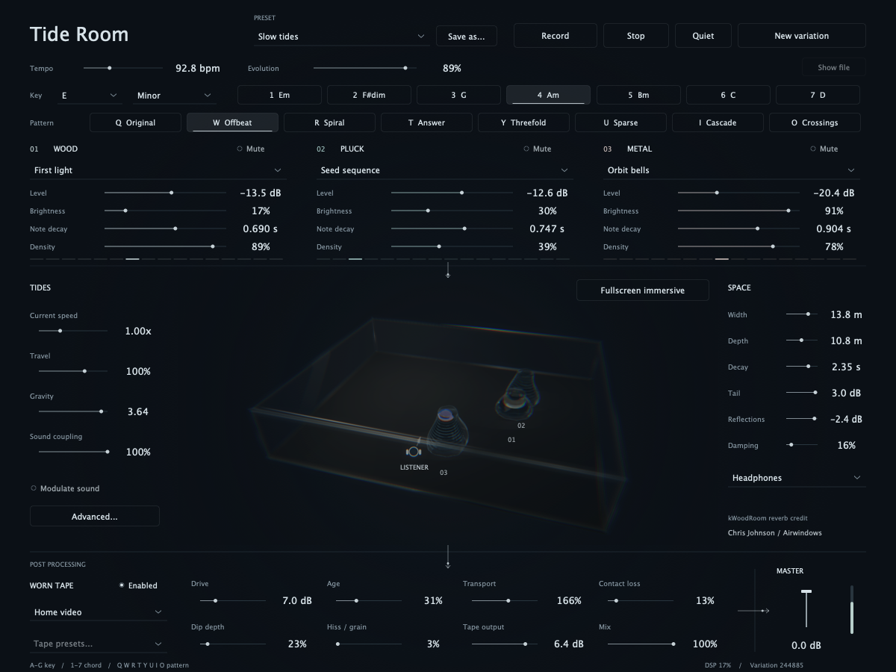
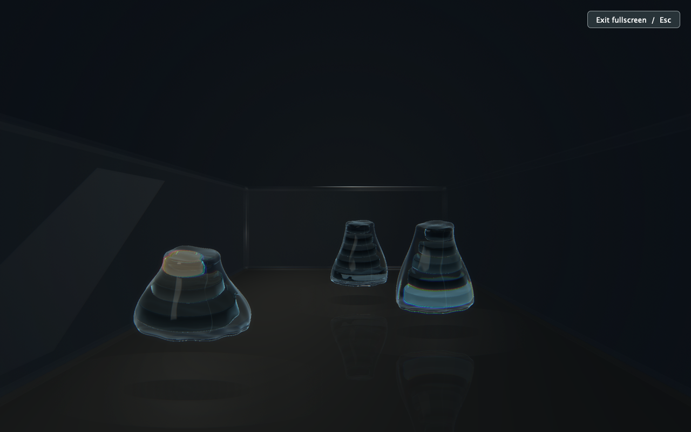

# Tide Room

A generative spatial synthesizer for Apple Silicon Macs. Three instruments move through a glass room, with water driven by their motion, gravity and collisions.



Each instrument is a stack of glass plates. A plate represents a pitch, lights when that note plays, and places its sound at the same height in the room. Overlapping notes keep their own spatial positions.

- Wavefolding, low-pass-gate, ring-modulated, AM and metallic voices.
- Eight patterns, key and chord selection, density and evolving accents.
- Tides that move the instruments and modulate their sound; full routing in **Advanced…**.
- Measured headphone spatialization, moving wall reflections and a shared room tail.
- Metal-rendered water and glass, note-reactive prism effects, and fullscreen listener view.
- Worn tape or 821, a master fader, complete-scene presets and stereo WAV recording.

The current version is **0.12.1**. The tape selector offers **Worn tape** and **821**, with independent settings saved in each scene. The 821 models require **48 kHz**; at other sample rates the app explains the requirement and passes aligned dry audio.

## Build and run

Requirements: an Apple Silicon Mac running macOS 14 or later, Xcode with its command-line tools and Metal compiler, CMake 3.22 or newer, and Git. The build fetches the pinned JUCE 8.0.9 source on first use. Python is not required to build the app.

```sh
git clone https://github.com/EricRuud/tide-room.git
cd tide-room
bash native/build-room.sh
open "build-room/app/Tide Room.app"
```

The app includes its runtime assets and native room processing; no external audio plugin is required. Local builds are ad-hoc signed. Developer ID signing and notarization are separate from this source build.

Start with headphones, 48 kHz and a 1024-sample buffer. Choose the output device in **Options** and press **Play**. See the [playing guide](native/ROOM-QUICKSTART.md) and [development guide](native/DEVELOPMENT.md) for controls, architecture and checks.

### Windows x64 preview

An experimental Windows build is available for Intel/AMD PCs. Open a successful
[Windows x64 preview workflow run](https://github.com/EricRuud/tide-room/actions/workflows/windows.yml)
and download the `Tide-Room-Windows-x64-preview` artifact (GitHub sign-in required).
Extract its preview ZIP, keeping `Resources` beside `Tide Room.exe`.

The audio engine, tape modes, presets and recorder are shared with the Mac app.
Graphics currently use the CPU fallback at reduced resolution; the Metal camera
prism effect is unavailable. Windows audio-device behavior and interactive frame
rate still need testing on real hardware. See the [Windows guide](native/WINDOWS.md)
for requirements, limitations and a reproducible PowerShell build.

## Inside the room

Drag a tower left/right and nearer/farther across the floor plane. Each pitch occupies a fixed plate in its stack. Water surrounds the whole stack and responds to the other instruments. **Fullscreen immersive** puts the camera at the listener; **Esc** returns to the controls.



## Presets and recordings

**Slow tides** is included. **Save as…** stores the whole scene, and the preset selector can recall or import scenes. On macOS, user presets live in `~/Library/Tide Room/Presets` and recordings in `~/Music/Tide Room Recordings`. The app also remembers its last session and audio-device settings.

**Record** captures the final stereo mix to a 32-bit float WAV. To keep a room tail, stop playback, let the sound fade, then stop recording.

## How Tide Room got here

Tide Room grew through a collaboration between Eric Ruud and Codex: musical references and listening feedback, research, small implementations, repeatable experiments, and another round of playing. Eric set the musical and visual direction and auditioned the results. Codex researched approaches, wrote code and measurement tools, compared outputs, and investigated failures. Numerical results informed the next experiment; they did not decide what sounded good.

The starting point was an offline sine-wavefolder instrument with a slowly changing tone. The first approved phrase became a preserved baseline. The project then became a playable native synth, acquired plucked and metallic voices, expanded into three instruments moving through a room, and developed its own spatial, tape and visual systems. The glass towers came much later. They grew out of a question about the name: could the instruments have tides that actually influenced their sound?

The account below describes the development through **0.12.0**, followed by the restoration of the 821 controls in **0.12.1**, including experiments that were rejected or retained only in the laboratory. Historical measurements belong to the particular builds and conditions stated; they are not all measurements of today's complete application.

- [The iteration loops](#the-iteration-loops)
- [Synthesis and the first technical gates](#synthesis-and-the-first-technical-gates)
- [Making space audible](#making-space-audible)
- [Tape research and measured models](#tape-research-and-measured-models)
- [From planets to playable glass towers](#from-planets-to-playable-glass-towers)
- [Measuring the complete instrument](#measuring-the-complete-instrument)
- [Reproducing the work](#reproducing-the-work)

### The iteration loops

There were several loops, with different acceptance criteria.

| Loop | What went in | What came back | What decided the next step |
| --- | --- | --- | --- |
| Musical audition | A preserved phrase, a bounded change, comparable renders | Listening comparisons and Eric's feedback | Whether space, attack, texture and movement served the instrument |
| DSP engineering | A specific hypothesis, fixed inputs and explicit limits | Waveform differences, spectra, state checks and timing | Technical gates, regressions and the cost of the change |
| Model identification | Controlled probes and separate training, validation and final material | Measured behavior, candidate fits and untouched final evaluations | Validation under fixed rules, followed by a frozen final comparison |
| Visual and interaction design | A running scene, screenshots and a concrete visual request | A revised renderer or interaction and another inspection | Legibility, material appearance, useful motion and consistency with the sound |
| Integration | The selected implementation in the real app | Playback captures, preset recall, stop/resume and package checks | Whether the whole instrument still worked without losing the session |

The early laboratory produced anonymous A/B/C listening files with a separate identity key. Later comparisons were often openly labeled auditions. They should not all be described as blind tests. Matching used one constant gain per version: sometimes RMS over a defined window, sometimes integrated loudness measured from the whole excerpt. No changing gain or mastering compressor was used to make the examples appear equal. In placement tests, matching the front position preserved the relative loudness of near, far, left and right positions.

The automated native loop is retained in [`native/evaluate.py`](native/evaluate.py): create a timestamped output directory, snapshot the relevant sources, build, run checks, render probes, apply the spectral gate, load the actual built VST3 in a host, and render presets for listening. A failed stage stops the loop. Separate runs covered Apple's Audio Unit validator and the running standalone app. The later Room checks extend this approach to spatial audio, water, presets, graphics and recording.

Each useful experiment kept its configuration, seeds, source identity, raw measurements and renders. Accepted sounds were preserved where possible with exact-output comparisons. For example, adding the first percussion responses left the six original preset renders byte-identical; adding an independent tape dip-depth control left all three earlier Worn presets sample-identical at the default depth. Changes that intentionally altered motion or routing were documented as such.

The original [evaluation plan](EVALUATION.md) also contains proposals. In particular, no trained human-preference model chose the sounds, and no numerical “musicality” score replaced listening.

### Synthesis and the first technical gates

The early voice explored wavefolding, slow harmonic motion and saturation. West Coast synthesis supplied a musical direction: coupled brightness and amplitude, struck notes with their own decay, and interacting oscillators. The eventual Pluck and Knock responses use a low-pass response with fast and slow envelope memory; Metal adds phase modulation, and later voices add bipolar ring modulation and unipolar amplitude modulation. These are original sound designs, without a claim of calibrated component-level circuit fidelity.

We first needed an evaluator that could distinguish a technical improvement from an attractive graph. The Python lab compared coherent stationary tones with an independent Bessel-series reference. It also compared a specified changing control trajectory against a higher-rate reference, checking that the reference itself converged. Deliberately aliased, stepped, static, silent and very quiet controls tested the evaluator. More harmonic motion was descriptive, not automatically better.

In that first experiment, 1× and 2× processing failed the provisional stationary criterion; 4× was the least expensive candidate that passed. That was a result for that prototype. As the native voice changed, the required processing changed too. A later `tanh` saturation chain failed a high-register case at approximately **−16 dB relative residual**. We changed the implementation rather than relaxing the **−90 dB** gate: a bounded, monotonic cubic saturation and **16×** processing, followed by a **6,145-tap FIR** with **192 host samples** of latency.

The resulting native stationary sweep passed **168/168 cases** at 44.1 and 48 kHz: seven coherent pitches, four folding depths and three saturation amounts. Its worst relative residual was **−122.72 dB**, measured through 0.4 times the sample rate. A separate 168-case metallic-source sweep reached **−121.47 dB** worst residual. These references were constructed independently in continuous phase, excluding harmonics at and above Nyquist before synthesis; gain and phase were not fitted to improve the score.

Musical behavior needed other tests. We exercised eight-note unison, repeated pitches, sustain, short and long taps, note stealing, timed MIDI, abrupt stopping, parameter changes, malformed state and different callback sizes. The original engine passed a **292-case unison stress sweep**, with a highest peak of **0.846094**. Dry percussion measurements showed the energy-weighted spectral centroid falling between attack and decay windows in all eight new presets. That supports “brighter attack, darker decay” on those fixtures; it does not establish an analog sound or a listening preference.

The definitions and provisional limits remain in [`criteria.json`](criteria.json); the native reference and checks are in [`native/analyze.py`](native/analyze.py), [`native/analyze_percussion.py`](native/analyze_percussion.py) and [`native/Tests/Checks.cpp`](native/Tests/Checks.cpp).

### Making space audible

Early listening feedback made the overall sense of space a priority. The first spatial auditions used the exact liked phrase through original synthetic reflection and decay designs, with controlled level matching. The goal was to preserve the notes while making their setting compelling, rather than treating maximum stereo width or the longest tail as an objective to optimize.

The first interactive room used three synth engines and a hosted spatial reverb. Headphone placement initially felt weak. A new direct path used the diffuse-field-equalized [MIT KEMAR measurements by Bill Gardner and Keith Martin](https://sound.media.mit.edu/resources/KEMAR.html), with interpolated ear filters, distance attenuation and propagation delay. Tide Room's generated bank contains 368 directions, mirrored for the other side, with the original 128-tap filters at 44.1 kHz. A disclosed left/front/right/far audition was judged more pronounced by Eric, and Headphones became the default.

The isolated direct-path checks measured approximately **±13.3 dB** left/right energy differences and about **12 dB** between 1.5 m and 6 m, across 44.1/48/96 kHz. These establish directional and distance cues. Generic mannequin filters do not establish accurate elevation perception or externalization for every listener; there is no personalized ear measurement or head tracking.

Moving the sources revealed a more consequential problem: crackles during continuous updates of the hosted reflection geometry. We instrumented the actual audio callback to capture each source before and after the effect, plus the final mix. With motion enabled and disabled, the synth input was sample-identical. The moving effect output contained **35 large second-difference events in ten seconds**, all within one sample of a 512-sample boundary; the fixed comparison contained none at that threshold. The largest was a **0.0421965** step. This localized a repeatable discontinuity in the processed signal, rather than merely assuming an overloaded audio device.

The repair gave movement its own renderer: **24 smoothly varying first- and second-order rectangular-room reflection paths** per source, with fractional delays, distance cues and darker higher-order reflections. Hosted geometry stayed fixed while that early field moved. The same capture and detector then found **zero** threshold crossings in the new reflection path and final mix; the reflection signal was checked to be active, so silence could not pass as a fix. The event detector was a diagnostic, not a universal measure of audible clicks.

The late room then became native. First, one shared **Airwindows kWoodRoom** replaced the three hosted reverb instances, while preserving the separate direct and moving early paths. Chris Johnson's upstream DSP is retained with its license and attribution. A later audition introduced the current **ClearRoom**: an original linear feedback delay network informed by [Geraint Luff's *Let's Write A Reverb*](https://signalsmith-audio.co.uk/writing/2021/lets-write-a-reverb/). It separates four feed-forward diffusion stages from a 16-channel decay network with frequency-dependent loss. The supported build selects ClearRoom; the earlier WoodRoom engine remains available in the source.

We evaluated reverb impulses using backward-integrated energy decay, octave-band T30 fits, stereo balance, correlation and normalized echo density. At a nominal 1.2-second decay with damping off, ClearRoom's measured broadband T30 estimate was **1.1995 seconds**, with octave estimates of **1.16–1.22 seconds**. At 35% damping, the 8 kHz estimate shortened to **0.83 seconds**; at full damping it fell to **0.47 seconds**. Default stereo energy balance was **−0.03 dB**, and echo density approached one around **40–60 ms**. Those measurements describe decay and diffusion; they do not prove a natural or preferable room.

This history explains the current architecture: independently positioned direct sound and early reflections feed a shared late field, then the whole room passes through tape and master gain. Room dimensions govern the geometric paths; they do not turn the fixed late network into a measured model of an arbitrary physical room. The implementation and checks are in [`Binaural.cpp`](native/Room/Binaural.cpp), [`MovingReflections.h`](native/Room/MovingReflections.h) and [`ClearChecks.cpp`](native/Room/ClearChecks.cpp).

### Tape research and measured models

Tape became its own research program because the desired effect involved more than darkening the output. We investigated how drive, signal history, generated harmonics, stereo behavior and transport could interact while leaving the spatial scene useful.

#### Physical and numerical experiments

The reading covered magnetic hysteresis, bias, wavelength and coating depth, record/replay response, contact loss and transport. Hardware specifications and service literature were used to distinguish operating conditions, not to declare a universally best machine. [Jatin Chowdhury's physical tape-modeling paper](https://www.dafx.de/paper-archive/2019/DAFx2019_paper_3.pdf) and the accompanying CHOW Tape source provided the basis for an early Jiles–Atherton adaptation. The [2023 neural tape-modeling paper](https://dafx.de/paper-archive/2023/DAFx23_paper_51.pdf) supplied another useful framing: assess nonlinear response, transport variation and noise separately.

The first magnetic adaptation failed high-frequency checks. Stronger oversampling filters alone did not solve it; integration around magnetic-field reversals mattered. The revised stage used reversal-aware RK4 integration and 32× processing. On its 30 stationary tone probes, worst measured unwanted energy improved from **−81.10 dB relative at 8×** to **−96.99 dB at 32×**. It was also expensive. Callback timing and bypass behavior were part of evaluating it, alongside the spectra.

We explored a separate offline model that penalized rapid changes in an output magnetization surrogate, including newly generated high harmonics. On one driven approximately 199 Hz tone, its added spatial term reduced 3–12 kHz harmonic energy by **6.79 dB** while changing the fundamental by **−0.00318 dB**. That was a synthetic mathematical experiment. Its padded polynomial calculations agreed with a more heavily padded version near double-precision limits, but changing the retained state bandwidth still changed the output materially. It was periodic and noncausal, and was not presented as a drop-in live tape machine.

That distinction mattered throughout the research: accurately calculating an approximation does not establish that the approximation matches tape. We also reviewed antiderivative antialiasing and stateful methods. [Zheleznov and Bilbao's interpolation study](https://dafx.de/paper-archive/2024/papers/DAFx24_paper_33.pdf), for example, distinguishes improvements in memoryless cases from restrictions in stateful systems. More oversampling, higher-order interpolation or a more complex solver had to earn its cost on the actual implementation.

#### Identifying the behavior of a reference plugin

A separate study measured **a popular 821 plugin** through its normal VST3 interface. It targeted specific fixed settings at **48 kHz**, first a **456 / 15 ips** configuration and then **900 / 30 ips**. This was behavioral identification: the input and output were observable, but the internal algorithm was not. The app does not load or require the reference plugin, and no vendor binary or commercial reference recording is included here.

The measurement sequence was designed to separate competing explanations:

1. **Establish repeatability and the quiet response.** Repeat identical captures, measure bypass and fixed latency, and characterize the low-level stereo impulse response before fitting dynamics.
2. **Excite memory.** Play a conditioning burst, then a quiet probe at controlled gaps. Compare combined, conditioner-only and probe-only outputs. Reversing probe polarity helps isolate the incremental response around a driven state.
3. **Vary the cause.** Change level, frequency, burst duration, crest factor and channel balance. Equal-RMS waveforms with different phases can expose behavior hidden by a single sine test.
4. **Test structure before adding capacity.** Compare static filters, level/history detectors, dynamic filter banks, recurrent controllers, stereo-width behavior and limiter hypotheses.
5. **Select on separate material, then freeze.** Reserve procedural seeds and recordings; freeze the candidate, dependencies, configuration and source hashes before opening or capturing the final target.

[Schoukens, Vaes and Pintolon's nonlinear identification overview](https://arxiv.org/abs/1804.09587) helped frame a recurring issue: a measured linear response can depend on the statistics and level of the excitation. In our own pilot-tone work, small probes sometimes failed amplitude-convergence checks. Increasing the probe level improved repeatability, but intermodulation remained part of the observed response. A frequency ratio measured beside a driven carrier could not simply be called an independent linear EQ curve.

The retained model combines explicit audio processing with learned, input-driven control: a measured quiet stereo FIR, level/history behavior, changing filters, width and limiter components. Target-informed fits of arbitrary control trajectories were used as diagnostics of what a structure might explain. Those trajectories were not available to the playable model. At inference, it receives the input and carries its own state.

The first major search completed **24 model/processing families and 732 continuous checkpoint comparisons**. Many variants shared trained weights; that is not 732 independent training runs. Increasing controller size did not consistently help. One doubled-state experiment selected its starting checkpoint after all training. Fixing state handling also mattered: chunked research renders initially reset state and disagreed with continuous playback. The corrected renderer carried controller and audio-filter state across chunks, with exact agreement in the tested chunk-size comparisons.

Long silent gaps exposed another failure: learned history persisted far longer than the reference response on conditioner/silence/note probes. A resting-state correction settled control state while preserving the audio filters and limiter. We retained that behavioral correction without interpreting it as a discovery about the reference's internal design.

Final scores used raw waveform differences, without fitted gain, EQ, delay or time warping. Listening exports used the same attenuation for each version. For clarity:

```text
residual dBr = 20 × log10(RMS(candidate − reference) / RMS(reference))
```

More negative means a smaller waveform difference. It is not a percentage of sound quality.

| Frozen evaluation | Result | What it establishes |
| --- | --- | --- |
| First 456 study, three previously unused recordings | **−24.91 / −38.10 / −32.06 dBr**, versus **−20.98 / −22.09 / −13.85 dBr** for the unchanged quiet linear baseline | A contribution beyond static coloration on those recordings; no perceptual-equivalence finding |
| Subsequent low-frequency correction, fresh reserved pattern | **−23.8955 → −24.7925 dBr**, about **10% lower RMS error**; reference repeat **−97.00 dBr** | A modest improvement larger than capture variation on one new pattern; some individual attacks still worsened |
| Refined 900 study, fresh four-level material | Overall **−15.51 → −15.84 dBr**; all four input-level groups improved slightly | A small independent improvement, with substantial remaining mismatch on hard-driven material |
| Refined 900 C++/Python port, five validation fixtures | Maximum sample difference about **1.79 × 10⁻⁷** | Fidelity of the implementation port, separate from fidelity to the reference |

The low-frequency extension preserved its parent weights and added a gated 440-parameter correction. Fixed retunings that improved steady tones were rejected when full-waveform validation worsened. The 900 refinement selected one parameter set halfway between an attack-focused and a recovery-focused checkpoint, under fixed regression guards. That is an offline average of weights running as one engine, not two audio engines blended during playback.

Fresh final comparisons were not used for another selection pass. Later probes remained exploratory. One follow-up found configuration-dependent output differences when the host buffer or input sample position changed, much larger than repeated captures under identical conditions. That result was specific to the measurement harness and was not independently reproduced in another host; it nevertheless made timing and host configuration part of the definition of the target.

The retained 821 models cover limited settings at 48 kHz. Their 4×/8× modes oversample the final limiter, not every stage. On some final clips the limiter never engaged, so all quality modes produced identical audio. A quiet residual, C++ parity or an “HQ” label cannot establish general equivalence, hardware accuracy or zero aliasing. The [final-evaluation code](native/Lab/p821_final_evaluation.py), [low-frequency freeze protocol](native/Lab/p821_lf_final.py) and [900 refinement selection](native/Lab/p821_900r2_select.py) preserve the mechanics of that work.

#### Worn tape and the return of the 821 option

The creative direction shifted toward a more adjustable worn-medium effect. **Worn tape is an independent model**, with emphasized recording, smooth nonlinear stages, replay shaping, shared stereo transport, contact-related filtering and dips, hiss/grain and a faint post-echo. Its Old cassette, Unspooled and Home video presets are artistic approximations, not measured reproductions of particular machines.

The important connections are deliberate: a contact event can soften treble, lower level and drag transport together. Both tracks share the main transport so pitch movement does not automatically tear apart the stereo placement. Dip depth was then separated from the other wear controls because the amount of level ducking needed its own musical adjustment.

An early 4× nonlinear path was rejected after strong-drive probes exposed unwanted components. The retained path uses first-order antiderivative antialiasing and 16× FIR oversampling. Tests cover sample rates, callback partitioning, exact silence with noise off, mono behavior, automation, mode changes and stopping after the room tail. In a twelve-second live integration capture, all captured channels were finite, peak callback load was **40.91%**, and no late callback was recorded. That is a short observation on the development machine, not a universal performance guarantee.

The interface was simplified to expose only [Worn tape](native/Room/WornTape.cpp), while the earlier engines and frozen 821 coefficients stayed in the source. In **0.12.1**, 821 returned as an option in the bottom tape strip: 456 / 15 ips or 900 / 30 ips, drive, output, wow/flutter, transport on/off, mix and limiter quality. Scene recall now preserves the selected 821 engine instead of forcing Worn tape. Switching models retains their individual settings; tape power and mix are shared. Slow tides still starts with Worn tape.

### From planets to playable glass towers

The visual design started with circles representing sources. The idea of giving each one an ocean made the name useful: neighboring bodies could pull on a tide, and its displacement could be patched into sound. Six bipolar X/Y signals became internal control sources for brightness/folding, ring depth, modulator ratio and decay. These are slow controls for audio-rate synthesis; they are not themselves audio-rate ring oscillators or hardware CV outputs.

The audio-clocked [Ocean model](native/Room/Ocean.h) uses softened attraction and a damped restoring motion at **240 Hz**. A separate [body model](native/Room/PlanetMotion.h) follows anchors and motion targets with inertia at **480 Hz**, resolves contact, and emits impact envelopes. The same resolved positions affect audio placement and the tide inputs. Contact latching prevents a pair held together by crossing targets from repeatedly retriggering impacts. Brief liquid bridges express a collision visually; they do not transfer simulated water between bodies.

This is a musical physics model. The displacement is bounded and exaggerated for control and readability. It is not a simulation of astronomical tides or a complete fluid-dynamics solution. Earlier surface-water experiments used conserved flux on a spherical mesh and tested volume, positivity and settling. The current tower renderer instead presents a continuous shaped water envelope with displaced silhouettes and traveling ripples. Its purpose is to show the shared movement clearly around a stack.

The visual iterations were substantial:

- Flat circles became planets, then strongly sloshing water over irregular surfaces. Feedback pushed the result toward smoother clear water and simpler materials.
- A glass case, refraction, thicker modeled edges, reflective lighting and chromatic separation gave the room an optical identity. Camera width and elevation changed repeatedly so the movement remained readable.
- Note lights made activity visible. Strong blur and whole-field note-triggered warping were tried, then reduced or removed after they overwhelmed the scene. Local note-reactive color separation survived, at a lower strength.
- Fractal, mesh and other camera layers were explored with live controls. They were later removed from the interface and disabled, leaving the audio-reactive prism treatment alongside the water and glass optics.
- The scene moved toward a restrained, dark studio presentation. Notes and tones occupy the top; minimal Tides controls sit left of the room; Space sits right; Worn tape and master finish the path below. Animated arrows indicate audio flow. Advanced controls preserve the deeper routing without filling the main view.

The renderer uses **Metal shaders**, with shared C++/Metal optical routines and a CPU reference. Refraction, reflections, glass interfaces and note effects are rendered locally; they are not video footage. This is a stylized real-time renderer, not a claim of complete physical light transport. The overview and fullscreen listener camera read the same scene, and switching between them is tested to leave the audio unchanged.

The final change gave each pitch its own plate in a tower. Lower pitches occupy larger, lower plates; only the played pitch lights. Stack centers sit at the lower golden section, about **38.2% of room height**, with the listener **1.10 m above the centers**. Dragging moves towers across the floor plane. The stacks became taller, the unlit plates became transparent dark glass, and one water volume replaced separate water around every plate.

That visual decision required an audio change. Each overlapping note now retains its own direct path, ear filtering, distance, propagation delay and early reflections at its plate's elevation. A ringing note whose pitch disappears after a harmony change keeps its last height. [`TowerNotes.h`](native/Room/TowerNotes.h) supplies the shared pitch/elevation mapping; [`TowerOptics.h`](native/Room/TowerOptics.h) supplies the shared optical geometry. The plates therefore describe the spatial instrument, rather than merely flashing over a single sound source.

### Measuring the complete instrument

Several kinds of evidence need to remain separate. A spectral residual can include filter, numerical and export error as well as aliasing. Energy outside legal harmonics is a useful stationary diagnostic, but cannot isolate aliases that land on harmonic bins. A model/reference waveform difference can include gain, phase, dynamics and stereo errors. None of these is a listening score.

Integration checks ask different questions: does block size alter the result; does state restore correctly; does bypass retain its intended latency; does Stop let tails drain; does Quiet reach silence; can a note or control update cross a callback boundary correctly? Recording uses a preallocated queue and background writer, capturing the final stereo bus after room, tape and master. Graphics checks compare CPU and Metal output and inspect rendered scenes. Preset checks exercise whole-scene recall, import, migration and non-destructive Save as.

Selected **0.12.0** measurements on the development **Apple M3 Max**:

| Check | Result | Scope |
| --- | --- | --- |
| Per-note audio separation | Maximum summed-stem difference **5.96 × 10⁻⁸** at 44.1/48/96 kHz | Preserves the original dry synth while separating voices; includes overlap, note-offs, stealing and panic |
| One saved scene with room and Worn tape | **32.2%** mean callback budget; **10.62 ms p99** against a **21.33 ms** deadline; no over-budget callbacks | Twelve-second contained render at 48 kHz / 1024 samples, not a long live-device endurance test |
| Dense 160 BPM scene at 96 kHz | About **90%** of callback budget on average | Demonstrates why 48 kHz has more useful margin; not a recommended universal 96 kHz workload |
| Metal rendering | **156 object, 71 case and 60 effect passes**, zero failures | CPU/Metal comparisons, unlit emission, one-pitch lighting, shared water, cameras and retained effects |
| 1280 × 800 fullscreen rendering | **38.4 ms** mean frame time | About 26 frames per second for this capture, not a 60 fps claim |
| Tower geometry | Containment, solid separation and floor clearance across **27 room sizes** | Includes overlapping spawns and fixed center-plane behavior |
| Camera changes | Exact audio equality through view switches | Both views share the visual/acoustic listener geometry |

Earlier application timing improved as hosted processing was replaced and expensive work was reduced or cached. Those historical runs used different scenes and conditions, so they are not a controlled speedup benchmark. Mean CPU load also cannot rule out scheduling spikes: some earlier runs passed ordinary averages but missed individual deadlines. We record percentiles, worst callbacks and over-budget counts where the harness provides them.

### Reproducing the work

The [development guide](native/DEVELOPMENT.md) gives commands for the supported build and current plate-audio, pitch-lighting, dragging, immersive, GPU, preset and physics checks. Use a fresh output directory for each run. GUI and Metal checks need a logged-in macOS desktop. The earlier Python and native instrument loops remain available for their own scopes.

The repository includes the implementations, test harnesses, generated runtime assets, frozen tape coefficients and third-party notices. It does **not** include the whole local experiment archive, personal sessions, listening feedback files, commercial reference captures or downloaded research papers. Historical figures above summarize retained development reports; some identification scripts need measurement data that is not distributed, so the complete historical fitting study cannot be reproduced from a checkout alone.

The public build was also tested from a separate clean source copy. Its 23 bundled tape coefficient files were checked against their SHA-256 manifest, the Apple Silicon bundle and runtime dependencies were inspected, and its local signature was verified. That establishes a self-contained source build; signing and notarizing a public binary remain a separate distribution step.

## Source layout

- `native/Room`: scene, audio placement, physics, Metal rendering, controls and checks.
- `native/Source`: shared synth engine and earlier instrument/plugin editions.
- `native/Assets` and `native/generated`: icons, factory scene, filters, original impulse responses and calibration data needed to build.
- `native/Lab`: retained DSP experiments and model-generation tools. Some research scripts expect local measurement data that is not part of this repository.
- Root Python files and `tests`: the earlier offline synthesis and listening laboratory.

## License and credits

**Reverb DSP:** Thanks to **Chris Johnson / [Airwindows](https://github.com/airwindows/airwindows)** for **kWoodRoom**, the reverb DSP used by Tide Room's retained WoodRoom engine. The upstream source, MIT license and copyright notice are included. See the [reverb attribution](native/Assets/ThirdPartyNotices/Airwindows-kWoodRoom-NOTICE.txt).

Original Tide Room code is copyright © 2026 Eric Ruud and licensed under **AGPL-3.0-only**, except where a file states other terms. See [LICENSE](LICENSE) and [THIRD_PARTY_NOTICES.md](THIRD_PARTY_NOTICES.md) for the full terms and component-specific licenses. JUCE, the CHOW Tape adaptation, Airwindows DSP and MIT KEMAR measurements retain their respective notices.
